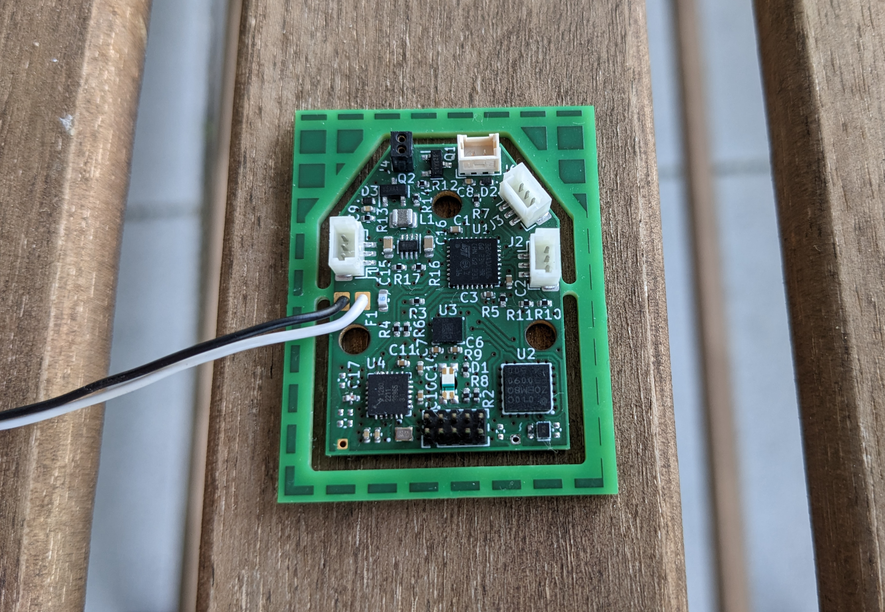

# Flight controller

# Hardware features

- :heavy_check_mark: Voltage regulator delivering 3.3 V to the ICs
- :x: Battery voltage monitor
  - Battery voltage monitor pin PA10 is not connected to a DAC.
- :heavy_check_mark: Pulse width modulated power supply of the main and tail rotor motors
- :x: Current monitor of the main and tail rotor motors
  - Pins PF0 and PF1 are not connected to any operational amplifiers. This makes
    current sensing inaccurate, since the shunt voltage is quite low.
- :heavy_check_mark: PWM control of the swashplate servos
- :heavy_check_mark: Programming and debugging interface via SWD and SWO
- :heavy_check_mark: Linear acceleration sensor and gyroscope
- :x: GPS receiver
  - No usable signal from antenna.
  - There is no good return path for the antenna signal.
- :x: Radio module with support for BLE, LoRa, FLRC, GFSK and ranging
  - Untested.
  - There is no good return path for the antenna signal.
- :heavy_check_mark: RGB status indicator LED
- :heavy_check_mark: Overcurrent protection (fuse)

## Possible improvements

- Connect reset pins of other ICs to the microcontroller.
- Connect the SX1280 busy pin and multi-purpose digital I/O pins to the
  microcontroller.
- Connect one PIO pin of the GNSS receiver to the microcontroller for TX ready
  notification.
- Add test points to GND, CS, SDI, SDO, SCK, RESET.
- Print version number on the PCB.
- Remove silk screen labels of small compenents.
- Make it possible to manually pull up the BOOT0 pin in case the firmware
  disrupts SWD communication.
- The top internal layer should be a ground plane to ensure a nice return path
  for the RF signal. Make a six layer board with layers: signal, ground, signal,
  power, signal, ground.

# GPIO pins

| Pin  | Function   | Configuration |
|------|------------|---------------|
| PA0  |            |               |
| PA1  | TAIL_CTL   | TIM15_CH1N    |
| PA2  | LEFT_CTL   | TIM2_CH3      |
| PA3  | /RADIO_CS  | output        |
| PA4  | /ACCEL_CS  | output        |
| PA5  | SCK        | SPI1_SCK      |
| PA6  | SDI        | SPI1_MISO     |
| PA7  | SDO        | SPI1_MOSI     |
| PA8  |            |               |
| PA9  |            |               |
| PA10 | BATT_MON   |               |
| PA11 | RIGHT_CTL  | TIM4_CH1      |
| PA12 | BACK_CTL   | TIM4_CH2      |
| PA13 | SWDIO      | SWDIO         |
| PA14 | SWCLK      | SWCLK         |
| PA15 |            |               |
| PB0  | /GNSS_CS   | output        |
| PB3  | SWO        | TRACESWO      |
| PB4  | LED_R      | TIM3_CH1      |
| PB5  | LED_G      | TIM3_CH2      |
| PB6  | MAIN_CTL   | TIM16_CH1N    |
| PB7  | LED_B      | TIM3_CH4      |
| PF0  | MAIN_SENSE | ADC1_IN10     |
| PF1  | TAIL_SENSE | ADC2_IN10     |
